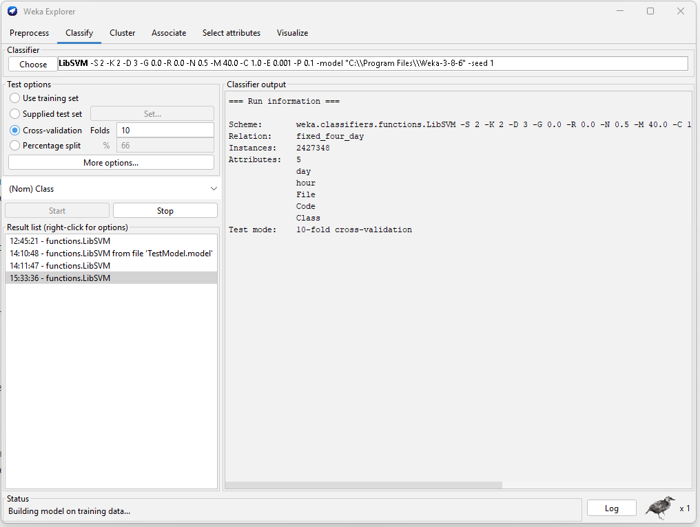
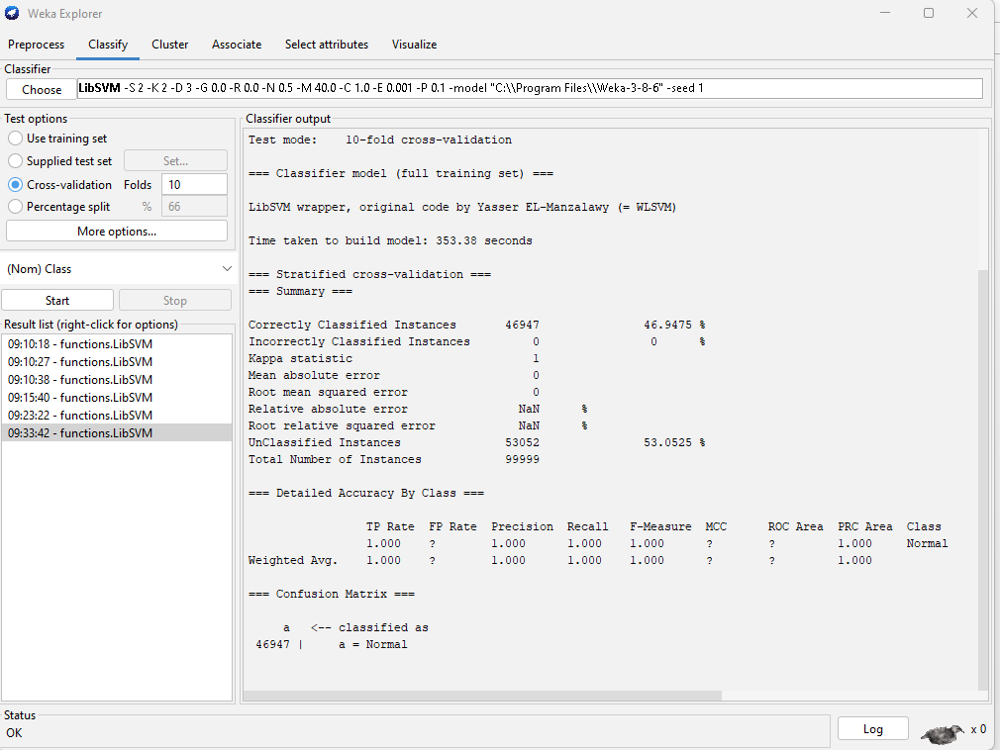
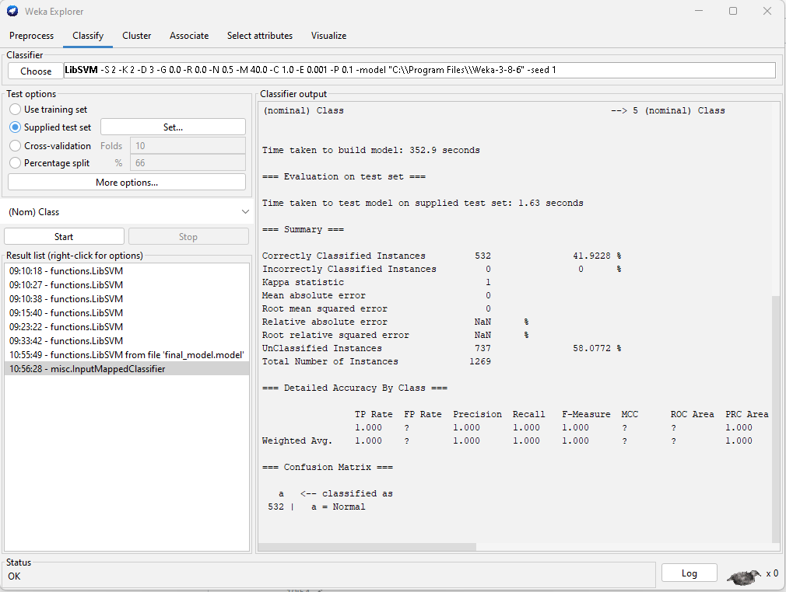
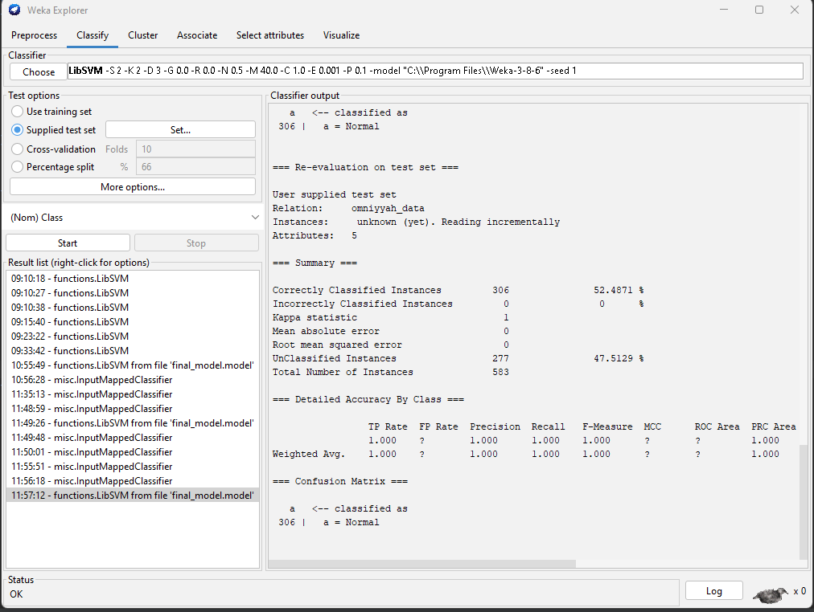

# Intro

For this project, I worked on a Windows laptop and as such I used the
`sensor.py` starter code provided. I built off of this starter code and my
resulting code can be found [here](https://github.com/SachinJay/IDSHW2)

The big picture idea I had was to try and pare down the amount of data gathered
as much as possible. I didn't want to have too many features from too many audit
sources creating too much data. I did not want this because there could be
spurious correlations picked up by the model that led to a bad predictor of
normal behavior. That is to say, my approach was to try and use only the most
important features and audit sources based on my knowledge of how I use my
computer.

# Audit Sources

As instructed in the `project2.pdf`, I enabled auditing on the File System. I
then pared down `input.txt` based on knowledge of how I used my computer and
test runs of my sensor.

Test runs of my sensor revealed too much data being collected. I ran the sensor
for one minute and calculated that based on the amount of data that was
collected in that minute, an hour of collecting data would amass 6GB of data.
This was obviously not feasible to gather over 4 days so I trimmed `input.txt`
down until there was just one line left: `C:\Users`

I know that this is where I do almost all of my interation with my computer's
filesystem and so I figured this would be representative of my usage profile.

To recap: my sole audit source was the File System of my computer, specifically
the `C:\Users` directory. I narrowed it down to this in order to have a
representative and compact dataset.

# Features

I did a lot of experimenting before settling on the features I would finally
use.

First, I experimented with the different log types. The Windows Event Log has
581 log types that I could discover. I used the code in `logtypes.py` (see
references) in order to discover this. I experimented with some of the log types
that seemed most interesting to me, specifically **System** and **Application**
as well as the default **Security** given to us.

I tried determing which one is best by reading the documentation, but Microsoft's
documentation on the area was sparse at best. So instead of that, I created the
script `do.py` to simulate my usage of the machine and then I checked which
log type actually picked up on these changes.

`do.py` creates, writes to, waits, and then deletes 3 different .txt files. The
only log type that picked up on these changes was the **Security** logs and so
I used those.

After settling on using the **Security** logs, I experimented with what features
to use to train my model. Looking at all the information captures in the
different event attributes, I noticed that the Event Category and Event Type
attributes were all the same for the Security events and so I discarded these.

Furthermore, I noticed that much of the String Inserts attribute seemed like
unexplained codes and so I disregarded most of these in case it caused too much
noise. I kept one such field as my last feature, just in case it was
discriminative.

I know that the time I use my computer is a very discriminative feature since
I only really use it within certain regular hours. So I kept the TimeGenerated
event attribute and made converted it into two numbers. See the references for
the resouce I used to do this. I broke the TimeGenerated attribute up into the
day an event was generated and the hour.

The last feature to talk about is the third of my four features: the file
that was touched. I extracted the name of the file from the StringInserts field
and kept this as a feature. I had some reservations about this because I was not
sure how well a model would respond to a string. But in the end I knew that I
needed to capture what files were touched in my model in order to properly
discriminate if a user was me or not so I included this feature.

# Code

The functions in my code have detailed docstrings, however the organization
needs some explaining.

`sensor.py` contains mostly vestigial code from my initial testing. In its main
method it calls code from `sec.py` which is where most of my implementation
actually resides. This structures is a vestige of how I initially did some
testing in `sensor.py` but then moved my testing of the **Security** logs to
`sec.py`.

`fix_csv.py` contains code I wrote to prepare my CSV for Weka. I had tried to
make the code in `sec.py` write the csv as properly as possible the first time
but there were two things I missed. 1) I Forgot to give each column a label and
2) I did not know I needed an extra **Class** column in order for the Single
Class SVM on Weka to work. `fix_csv.py` takes care of both these issues.

# Model

After reading the RUU paper, I initially planned on using a Gaussian Mixture
Model (GMM) in order to model my "normal" behavior. However, after being unable
to find much documentation or support for GMMs, I looked more into single-class
anomaly detection algorithms and found out about single-class support vector
machines (SVMs).

This model had a lot more documentation in Weka and I was able to more easily
comprehend how to get it working properly so I went with this model. To this
end, I imported teh LibSVM module into Weka and used the single-class SVM
mode in order to train on my data set. I used k-fold cross validation during
testing with `k=10`.

Here is a screenshot of my model as it trained:

And after it finished:

## False Positive Rate and Analysis
Once my model was trained (took about 18 hours since there was so much data)
, I used it to predict the class of my test data. That is, of the data I
collected on the fifth day. This resulted in the following output:

One thing to note about this is that Weka cannot calculate the false positive
rate due to the fact that there is only one class. We can however deduce it from
the true negative rate since the only examples we fed the models were negative
(i.e. the only instances fed to the model were normal instances). The model
correctly predicted the class 46.9% of the time meaning that it incorrectly
classified 53.1% of the instances as abnormal. Thus it falsely sounded the alarm
53.1% of the time meaning the false positive rate is 53.1%.

### Analysis
A 53.1% false positive rate is fairly high. I think there are a few reasons why
the model was not good enough to achieve a lower false positive rate.

1. Features not discriminative enough
    - I chose the minium set of features that I believed would be discriminative
    enough to build a good model of what is my normal behaviour. However, I
    think that it is likely that this small set of features was not enough to
    properly build a model of my behavior. Since essenentially what I was
    tracking was file touches and the day and time, I think the model could have
    benefitted from more specific information about my access. E.g. file type,
    file access duration, keystroke types etc.
2. Not enough audit sources
    - As I described before, I tried to pare down the number of audit sources
    and the number of features so that the volumne of data collected would not
    be ridiculously large. However, I fear that I may have gone too much in
    the other direction. Perhaps collecting logs from more than just the
    `C:\Users` directory would have made for a better model. For example the
    `C:\ProgramFiles` directory may have given better data as it would have
    provided information on the specific programs that I use in my day-to-day
    use of my machine.
3. Not Enough data
    - I collected a large amount of data: about 161 MB with hundreds of
    thousands of rows. However I think it is possible that the data collected
    did not suffice to prepare the model for the test data. This is because
    the test data was collected on a fifth day (a Friday) and the training data
    was collected from Monday-Thursday. Because the day of the week was one of
    my features, Friday was a hitherto unseen value for the day of the week
    column and thus may have caused confusion in the model. 
4. Single Class SVM may be worse than GMM for the task
    - It also may be the case that Single Class SVM may not have been up to the
    task of working with the mix of numerical and nominal data that I had.
    Perhaps a GMM as described in the RUU paper would have performed better.

# Team Work
I worked together with Omniyyah Ibrahim. In order to record data properly, we
swapped sensor code and ran that on each other's machines. This way, our data
format would match what the other's model expected.

I was able to run Omniyyah's sensor on my machine, however Omniyyah could not
run my sensor on her machine. Because of this, I wrote some code to transform
her data into a format my sensor would recognize. Luckily Omniyyah recorded
more than enough data so that I could easily transform her data into my format.

The code for this transformation logic is located in `transform_omniyyah.py`.

After transforming Omniyyah's data, I then ran my model on the data and got
the following results.

## TP rate and analysis

### TP Rate
As we can see from the Weka results, the model "correctly classified" 52.5%
of all instances. However, since there is only class, I had to mark Omniyyah's
data as normal (despite the fact that it is abnormal). Thus, if my model
was a good model, we would expect a vert low correctly classified instances rate
since we would want most of the instances to be reported as anomalous.

Instead, only 47.5% of all instances were actually found to be abnormal. That is
the **True Positive Rate was 47.5%**

### Analysis
As stated in my previous analysis I believe my model could have become confused
for a variety of reasons. It is this confusion that led to poor performance on
actual anomalous behavior. Because my model was not a good model of what was
normal, it could not properlly detect what was abnormal either.

# References

The following are some of the sites I used to develop `sensor.py`

- [Stack overflow 1](https://stackoverflow.com/questions/61003020/python-2-7-pywin32-readeventlog-returns-partial-list-of-events)
    - I used this to read the entire contents of the log
- [Stack overflow 2](https://stackoverflow.com/questions/42944791/reading-windows-event-log-using-win32evtlog-module)
    - I used this to figure out how to continuously read from the buffer
    - It also helped me realize there are many different log types
- [Learning win32evtlog in python](https://stackoverflow.com/questions/42944791/reading-windows-event-log-using-win32evtlog-module)
    - This showed me how to get all possible log types. I used it to implement
    the main functionality of `logtypes.py`
- [Python datetime object](https://www.digitalocean.com/community/tutorials/python-string-to-datetime-strptime)
    - for converting datetime in the logs to usable features
- [One Class SVM on Weka](https://medium.com/analytics-vidhya/using-oneclasssvm-in-weka-3908d08aabf6)
- [Removing unnamed columns from a csv](https://stackoverflow.com/questions/43983622/remove-unnamed-columns-in-pandas-dataframe)
